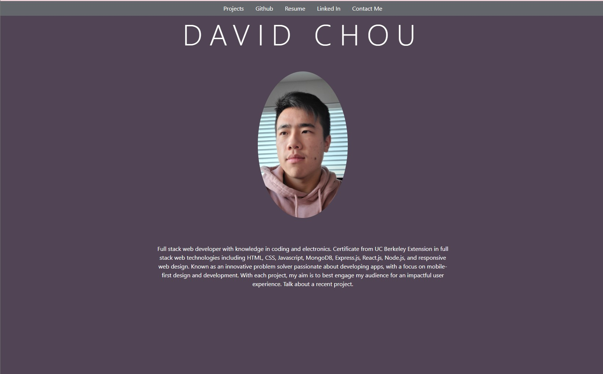
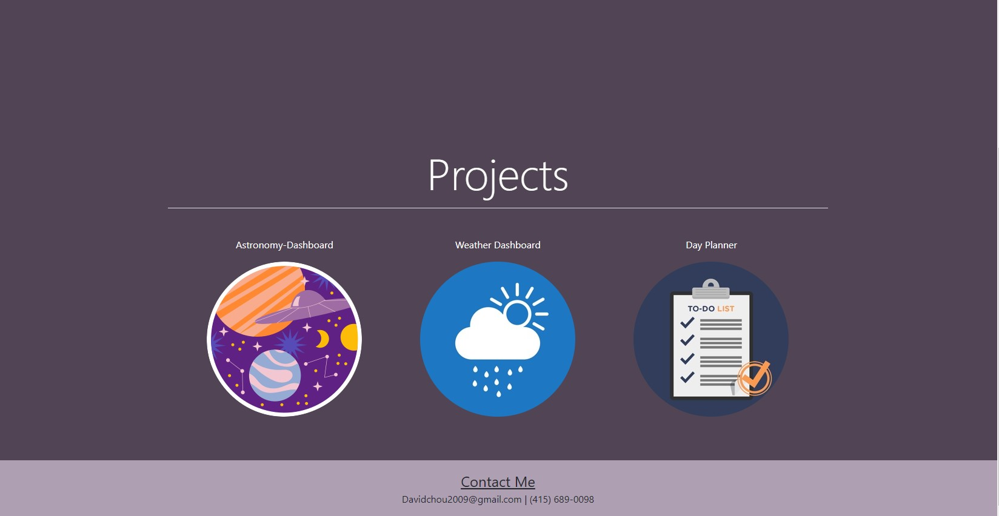

# Updated-Portfolio

This is my portfolio where I have a breif description about me and links to a few of my works that I have done. My list of projects will expand as time goes by.

### Prerequisites

There is no prerequisite software needed.

## Screenshots

## Built With

* [HTML](https://developer.mozilla.org/en-US/docs/Web/HTML)
* [CSS](https://developer.mozilla.org/en-US/docs/Web/CSS)
* [Javascript](https://developer.mozilla.org/en-US/docs/Web/JavaScript)
* [Bootstrap](https://getbootstrap.com/)

## Deployed Link

* [See Live Site](https://dazedchou.github.io/Updated-Portfolio/)

## Authors

* **David Chou** 

- [Link to Portfolio Site](https://dazedchou.github.io/Updated-Portfolio/)
- [Link to Github](https://github.com/DazedChou)
- [Link to LinkedIn](https://www.linkedin.com/in/Davidchou99)

## License

This project is licensed under the MIT License 

